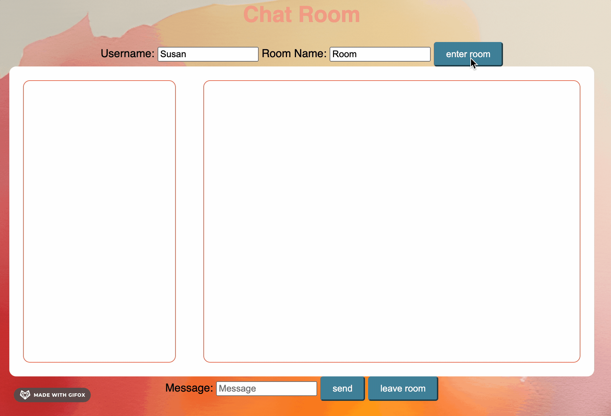
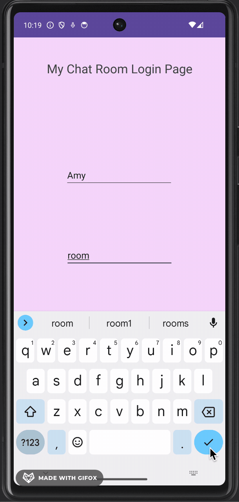

# Chat Server and Client
This threaded server adeptly adheres to the appropriate protocols, handling both HTTP and WebSocket requests. Two WebSocket-enabled clients have been developed: a web client and an Android app client. Both clients seamlessly join chat rooms and engage with other participants. The server meticulously tracks room occupants, facilitates the addition and removal of clients, and ensures precise message distribution among participants.
## Steps Involved
Many hand drawn bubble diagrams! 🖊️🌐😅
## Future Steps
While one person humorously referred to this project as 'dumb Slack,' the aspiration is to evolve it into 'smart Slack'! To achieve this goal, here are some potential enhancements and future steps for the project:

- Implement user authentication and comprehensive user management features.
- Elevate the chat room experience by adding features such as file sharing.
- Enhance server performance and scalability to gracefully handle a substantial influx of concurrent connections.
- Expand the reach of the project by developing client applications for diverse platforms.
## Demo

## Try Me Out!
1. Clone this repository and open the 'ThreadedWebServer' folder in your preferred Integrated Development Environment (IDE). Compile the code from the main file.
2. While the server is up and running, open your default web browser and navigate to "localhost:8080/chat.html." You can repeat this process with multiple web browsers to thoroughly test the chat functionality from various browser instances.
3. Launch the 'AndroidChatClient' folder using any IDE that supports an Android simulator, such as Android Studio.
4. From your Android simulator, join a chat room and engage in conversation with users on web browsers. 🚀
### Version History
Server: 
Web Client: 
Android App: 
